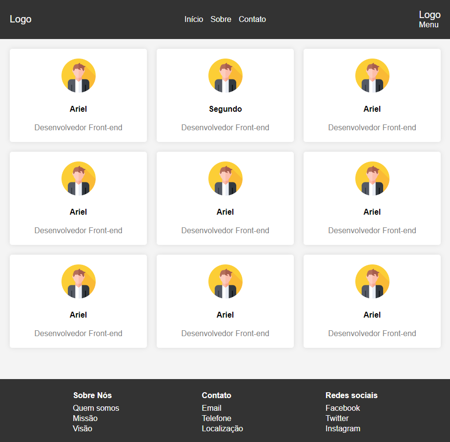

# Página com Cards Responsivos em ReactJs + Vite

> Projeto feito na Digital College como exercício de HTML+CSS e agora utilizando o ReactJs + Vite com typescript.

### Ajustes e melhorias

O projeto ainda está em desenvolvimento e as próximas atualizações serão voltadas nas seguintes tarefas:

- [ ] Modernização do Layout
- [ ] Implementação de outras páginas
- [ ] Sistema de Login
- [ ] Cadastro de Usuários com Backend
- [x] Built with ReactJs + Vite

## 🤝 Colaboradores

Agradecemos às seguintes pessoas que contribuíram para este projeto:

<table>
  <tr>
    <td align="center">
      <a href="#" title="defina o titulo do link">
         
        
          <b>Gabriel Porto</b>
        
      </a>
    </td>
  </tr>
</table>

